# NetTwin AI

NetTwin AI is a unified GNS3 automation and network change impact analysis platform.

Sprint 0 established the repository architecture, environment configuration, backend/frontend placeholders, and project documentation.

Sprint 1 adds the vendor-neutral topology domain model, YAML/JSON parsing, topology validation, and example network specifications.

Sprint 2 adds the IPv4 addressing and VLSM planning engine, including reserved ranges, fixed subnet handling, point-to-point allocation, and explainable address planning output.

Sprint 3 adds the asynchronous GNS3 API client, template resolution, project/node/link resource management, and mocked deployment orchestration tests.

Sprint 4 adds deterministic topology layout, platform profiles, interface-to-port mapping, and GNS3 topology deployment planning.

Sprint 5 adds Jinja2-based configuration generation, per-device rendering contexts, configuration preview output, deterministic hashes, and snapshot tests.

Sprint 6 adds configuration deployment over Telnet console sessions, prompt detection, CLI discovery, adapter-based parsing, and discovered network state snapshots.

Sprint 7 adds a NetworkX-based digital twin graph engine, multi-layer graph views, graph queries, and React Flow serialization.

## Planned Workflow

```text
User Requirement
  -> Topology Specification
  -> IP Address Planning
  -> GNS3 Deployment
  -> Configuration Generation
  -> Configuration Application
  -> Network Validation
  -> Digital Network Model
  -> Proposed Change Simulation
  -> Impact and Risk Analysis
  -> User Approval
  -> Apply Change to GNS3
  -> Post-Change Verification
  -> Rollback or Final Report
```

## Repository Layout

```text
backend/
  app/
  tests/
frontend/
  src/
docs/
templates/
examples/
```

## Backend Modules

- `domain`: vendor-neutral network domain model and business rules
- `topology`: topology parsing and normalization
- `addressing`: IP planning and VLSM logic
- `gns3`: GNS3 REST/WebSocket integration
- `configuration`: configuration rendering and diffing
- `discovery`: running-state collection and parsing
- `graph`: connectivity and dependency graph services
- `validation`: test execution and topology validation
- `changes`: change commands and workflows
- `simulation`: isolated change simulation engine
- `impact`: impact detection and risk scoring
- `rollback`: rollback planning and execution
- `reporting`: reports
, audits, and exports
- `ai`: structured LLM integration layer
- `api`: FastAPI transport layer

## Quick Start

### Backend

```powershell
cd backend
python -m venv .venv
.venv\Scripts\Activate.ps1
pip install -e .[dev]
uvicorn app.main:app --reload
```

API health check:

```powershell
curl http://127.0.0.1:8000/health
```

### Frontend

```powershell
cd frontend
npm install
npm run dev
```

### GNS3 Connectivity Check

```powershell
Invoke-WebRequest http://[::1]:3080/v2/version -UseBasicParsing
```

## Sprint 0 Deliverables

- initial backend architecture
- initial frontend placeholder
- environment and logging configuration
- architecture documentation
- Mermaid system diagram
- basic automated tests
- repository scaffolding for later sprints

## Sprint 1 Deliverables

- vendor-neutral `TopologySpec`
- Pydantic domain models for network objects
- YAML and JSON topology parsing
- topology validation engine
- three example topology specifications
- topology parser and validation tests

## Sprint 1 Usage

### Run Backend Tests

```powershell
cd backend
.venv\Scripts\Activate.ps1
pip install -e .[dev]
pytest
```

### Run Only Sprint 1 Topology Tests

```powershell
cd backend
.venv\Scripts\Activate.ps1
pytest tests/test_topology_service.py -q
```

### Validate an Example Topology File

```powershell
cd backend
.venv\Scripts\Activate.ps1
python -c "from pathlib import Path; from app.topology.service import TopologyService; spec = TopologyService.load_file(Path('..') / 'examples' / 'three-vlan-office.yaml'); print(spec.project.name, len(spec.devices), len(spec.vlans))"
```

Expected output:

```text
three-vlan-office 5 3
```

### Test JSON Serialization Round-Trip

```powershell
cd backend
.venv\Scripts\Activate.ps1
python -c "from pathlib import Path; from app.topology.service import TopologyService; spec = TopologyService.load_file(Path('..') / 'examples' / 'guest-isolation.yaml'); serialized = TopologyService.to_json(spec); restored = TopologyService.load_json(serialized); print(restored.project.name)"
```

Expected output:

```text
guest-isolation
```

## Example Topologies

- `examples/three-vlan-office.yaml`
- `examples/two-router-ospf.yaml`
- `examples/guest-isolation.yaml`

## Sprint 2 Deliverables

- deterministic IPv4 VLSM planner
- reserved subnet support
- fixed subnet support
- point-to-point /30 and /31 allocation
- gateway, switch management, and endpoint address assignment
- explainable address planning report
- automated tests for exhaustion, overlap, and mixed requirements

## Sprint 2 Usage

### Run All Backend Tests

```powershell
cd backend
.venv\Scripts\Activate.ps1
pip install -e .[dev]
pytest
```

### Run Only Sprint 2 Addressing Tests

```powershell
cd backend
.venv\Scripts\Activate.ps1
pytest tests/test_addressing_service.py -q
```

### Generate a VLSM Plan from the Terminal

```powershell
cd backend
.venv\Scripts\Activate.ps1
python -c "from ipaddress import IPv4Network; from app.addressing.models import AddressingRequest, SegmentRequirement; from app.addressing.service import AddressingService; request = AddressingRequest(base_network=IPv4Network('10.10.0.0/16'), segments=[SegmentRequirement(name='ADMIN', host_count=40), SegmentRequirement(name='STUDENT', host_count=200), SegmentRequirement(name='GUEST', host_count=100)]); plan = AddressingService.plan(request); print(plan.report)"
```

Expected key allocations:

```text
STUDENT -> 10.10.0.0/24
GUEST -> 10.10.1.0/25
ADMIN -> 10.10.1.128/26
```

### Validate Reserved and Fixed Subnet Behavior

```powershell
cd backend
.venv\Scripts\Activate.ps1
python -c "from ipaddress import IPv4Network; from app.addressing.models import AddressingRequest, SegmentRequirement; from app.addressing.service import AddressingService; request = AddressingRequest(base_network=IPv4Network('10.20.0.0/24'), reserved_networks=[IPv4Network('10.20.0.0/26')], segments=[SegmentRequirement(name='VOICE', host_count=20, fixed_subnet=IPv4Network('10.20.0.128/27'))]); plan = AddressingService.plan(request); print(plan.allocations[0].network)"
```

Expected output:

```text
10.20.0.128/27
```

### Try Different Host Inputs

If the user enters different host counts, the planner recalculates a new subnet plan. Example:

```powershell
cd backend
.venv\Scripts\Activate.ps1
python -c "from ipaddress import IPv4Network; from app.addressing.models import AddressingRequest, SegmentRequirement; from app.addressing.service import AddressingService; request = AddressingRequest(base_network=IPv4Network('192.168.0.0/24'), segments=[SegmentRequirement(name='HR', host_count=20), SegmentRequirement(name='IT', host_count=50), SegmentRequirement(name='SALES', host_count=10)]); plan = AddressingService.plan(request); print(plan.report)"
```

Another example with larger requirements:

```powershell
cd backend
.venv\Scripts\Activate.ps1
python -c "from ipaddress import IPv4Network; from app.addressing.models import AddressingRequest, SegmentRequirement; from app.addressing.service import AddressingService; request = AddressingRequest(base_network=IPv4Network('172.16.0.0/20'), segments=[SegmentRequirement(name='VLAN10', host_count=400), SegmentRequirement(name='VLAN20', host_count=100), SegmentRequirement(name='VLAN30', host_count=60), SegmentRequirement(name='VLAN40', host_count=12)]); plan = AddressingService.plan(request); print(plan.report)"
```

### Test Address Exhaustion

If the requested hosts do not fit inside the base network, the planner must fail with an `AddressPlanningError`:

```powershell
cd backend
.venv\Scripts\Activate.ps1
python -c "from ipaddress import IPv4Network; from app.addressing.models import AddressingRequest, SegmentRequirement; from app.addressing.service import AddressingService; request = AddressingRequest(base_network=IPv4Network('192.168.1.0/29'), segments=[SegmentRequirement(name='LAB', host_count=10)]); print(AddressingService.plan(request).report)"
```

## Documentation

- [Architecture](docs/architecture.md)

## Sprint 3 Deliverables

- async `GNS3Client` built on `httpx.AsyncClient`
- GNS3 project lifecycle service
- template resolver for `iosv`, `iosvl2`, `vpcs`, and related logical names
- node and link management services
- deployment orchestrator with rollback on partial failure
- dry-run deployment planning
- mocked API tests for version, templates, deployment, and rollback

## Sprint 3 Usage

### Verify GNS3 Connectivity Before Tests

```powershell
Invoke-WebRequest http://[::1]:3080/v2/version -UseBasicParsing
Invoke-WebRequest http://[::1]:3080/v2/projects -UseBasicParsing
Invoke-WebRequest http://[::1]:3080/v2/templates -UseBasicParsing
```

### Run Only Sprint 3 GNS3 Tests

```powershell
cd backend
.venv\Scripts\Activate.ps1
pip install -e .[dev]
pytest tests/test_gns3_client.py -q
```

### Inspect Available GNS3 Templates

```powershell
cd backend
.venv\Scripts\Activate.ps1
python -c "import asyncio; from app.gns3.client import GNS3Client; async def main():\n    async with GNS3Client() as client:\n        templates = await client.list_templates();\n        print([(template.name, template.template_id) for template in templates]);\nasyncio.run(main())"
```

### Resolve a Logical Platform Name

```powershell
cd backend
.venv\Scripts\Activate.ps1
python -c "import asyncio; from app.gns3.client import GNS3Client; from app.gns3.services import GNS3TemplateResolver; async def main():\n    async with GNS3Client() as client:\n        resolver = GNS3TemplateResolver(client); template = await resolver.resolve('iosv'); print(template.name, template.template_id)\nasyncio.run(main())"
```

### Retrieve GNS3 Server Version Through the Backend Client

```powershell
cd backend
.venv\Scripts\Activate.ps1
python -c "import asyncio; from app.gns3.client import GNS3Client; async def main():\n    async with GNS3Client() as client:\n        version = await client.get_version(); print(version.version, version.local)\nasyncio.run(main())"
```

## Sprint 4 Deliverables

- platform profiles for `IOSv`, `IOSvL2`, and `VPCS`
- interface-to-port mapping service
- deterministic topology coordinate assignment
- dry-run topology deployment planner
- link creation requests derived from `TopologySpec`
- deployment result device mapping
- mocked deployment tests for layout, mapping, and orchestration

## Sprint 4 Usage

### GNS3 Preflight Before Sprint 4

Make sure these template conditions are true in GNS3:

- `IOSv` template exists
- `IOSvL2` template exists
- `VPCS` template exists
- `IOSv` adapters >= `4`
- `IOSvL2` adapters >= `8`

Re-check templates:

```powershell
Invoke-WebRequest http://[::1]:3080/v2/templates -UseBasicParsing
```

### Run Only Sprint 4 Deployment Tests

```powershell
cd backend
.venv\Scripts\Activate.ps1
pip install -e .[dev]
pytest tests/test_gns3_deployment.py -q
```

### Build a Dry-Run Topology Deployment Plan

```powershell
cd backend
.venv\Scripts\Activate.ps1
python -c "from pathlib import Path; from app.topology.service import TopologyService; from app.gns3.profiles import PlatformProfileLoader, PortMappingService; from app.gns3.deployment import TopologyDeploymentPlanner, TopologyLayoutService; spec = TopologyService.load_file(Path('..') / 'examples' / 'three-vlan-office.yaml'); planner = TopologyDeploymentPlanner(PlatformProfileLoader(), PortMappingService(PlatformProfileLoader()), TopologyLayoutService()); plan = planner.build_plan(spec); print(plan.model_dump_json(indent=2))"
```

### Validate Interface Mapping for a Logical Interface

```powershell
cd backend
.venv\Scripts\Activate.ps1
python -c "from app.gns3.profiles import PlatformProfileLoader, PortMappingService; service = PortMappingService(PlatformProfileLoader()); mapping = service.resolve('iosv', 'GigabitEthernet0/1'); print(mapping.adapter_number, mapping.port_number)"
```

Expected output:

```text
1 0
```

## Sprint 5 Deliverables

- Jinja2 template registry for `iosv`, `iosvl2`, and `vpcs`
- device context builder driven by `TopologySpec`
- rendered configuration preview output
- deterministic SHA-256 configuration hashes
- basic rendered syntax validation
- snapshot tests for generated configurations

## Sprint 5 Usage

### Install Sprint 5 Dependencies

```powershell
cd backend
.venv\Scripts\Activate.ps1
pip install -e .[dev]
```

### Run Only Sprint 5 Configuration Tests

```powershell
cd backend
.venv\Scripts\Activate.ps1
pytest tests/test_configuration_generator.py -q
```

### Render Configuration Preview for the Three-VLAN Office

```powershell
cd backend
.venv\Scripts\Activate.ps1
python -c "from pathlib import Path; from app.configuration.generator import ConfigurationRenderer; from app.topology.service import TopologyService; spec = TopologyService.load_file(Path('..') / 'examples' / 'three-vlan-office.yaml'); print(ConfigurationRenderer().preview_text(spec))"
```

### Render a Single Device Configuration and Hash

```powershell
cd backend
.venv\Scripts\Activate.ps1
python -c "from pathlib import Path; from app.configuration.generator import ConfigurationRenderer; from app.topology.service import TopologyService; spec = TopologyService.load_file(Path('..') / 'examples' / 'three-vlan-office.yaml'); renderer = ConfigurationRenderer(); device = next(item for item in spec.devices if item.id == 'r1'); rendered = renderer.render_device(spec, device); print(rendered.content); print(rendered.content_hash)"
```

### Validate OSPF Rendering on the Two-Router Example

```powershell
cd backend
.venv\Scripts\Activate.ps1
python -c "from pathlib import Path; from app.configuration.generator import ConfigurationRenderer; from app.topology.service import TopologyService; spec = TopologyService.load_file(Path('..') / 'examples' / 'two-router-ospf.yaml'); preview = ConfigurationRenderer().render_topology(spec); print(next(item.content for item in preview.rendered_configurations if item.device_id == 'r1'))"
```

## Sprint 6 Deliverables

- GNS3 node console information retrieval
- Telnet console channel abstraction using `telnetlib3`
- Cisco IOS and VPCS prompt detection
- Cisco initial configuration dialog handling
- configuration application with CLI error detection
- discovery parsers for interfaces, VLANs, trunks, routes, ACLs, and OSPF neighbors
- desired and discovered state snapshots
- simulated console and parser tests

## Sprint 6 Usage

### Install Sprint 6 Dependencies

```powershell
cd backend
.venv\Scripts\Activate.ps1
pip install -e .[dev]
```

### GNS3 Preflight Before Sprint 6

Verify that `IOSv`, `IOSvL2`, and `VPCS` nodes boot successfully in GNS3 and that console access works.

Check GNS3 API availability:

```powershell
Invoke-WebRequest http://[::1]:3080/v2/version -UseBasicParsing
Invoke-WebRequest http://[::1]:3080/v2/templates -UseBasicParsing
```

Confirm at least one live console from GNS3:

- `IOSv` should reach `Router>` or `Router#`
- `IOSvL2` should accept `enable`
- `VPCS` should accept `show`

### Run Only Sprint 6 Parser Tests

```powershell
cd backend
.venv\Scripts\Activate.ps1
pytest tests/test_discovery_parsers.py -q
```

### Run Only Sprint 6 Discovery Session Tests

```powershell
cd backend
.venv\Scripts\Activate.ps1
pytest tests/test_discovery_service.py -q
```

### Run Both Sprint 6 Test Files

```powershell
cd backend
.venv\Scripts\Activate.ps1
pytest tests/test_discovery_parsers.py tests/test_discovery_service.py -q
```

### Inspect GNS3 Console Info for a Deployed Node

```powershell
cd backend
.venv\Scripts\Activate.ps1
python -c "import asyncio; from app.gns3.client import GNS3Client; async def main():\n    async with GNS3Client() as client:\n        console = await client.get_node_console('YOUR_PROJECT_ID', 'YOUR_NODE_ID'); print(console.model_dump())\nasyncio.run(main())"
```

### Parse Sample Discovery Output from the Terminal

```powershell
cd backend
.venv\Scripts\Activate.ps1
python -c "from app.discovery.parsers import DiscoveryParserRegistry; parser = DiscoveryParserRegistry(); output = 'Interface                  IP-Address      OK? Method Status                Protocol\\nGigabitEthernet0/0         unassigned      YES unset  administratively down down\\nGigabitEthernet0/1         10.0.0.1        YES manual up                    up\\n'; print(parser.parse_ip_interface_brief(output))"
```

## Sprint 7 Deliverables

- NetworkX digital twin graph engine
- desired-state graph construction from `TopologySpec`
- discovered-state graph construction from `DiscoveredNetworkState`
- graph views for physical, layer 2, layer 3, dependency, and service topology
- graph queries for VLAN membership, trunks, dependencies, paths, and disconnected components
- React Flow serialization
- graph engine tests

## Sprint 7 Usage

### Install Sprint 7 Dependencies

```powershell
cd backend
.venv\Scripts\Activate.ps1
pip install -e .[dev]
```

### Run Only Sprint 7 Graph Tests

```powershell
cd backend
.venv\Scripts\Activate.ps1
pytest tests/test_graph_service.py -q
```

### Build a Desired Graph from the Three-VLAN Office Example

```powershell
cd backend
.venv\Scripts\Activate.ps1
python -c "from pathlib import Path; from app.graph.service import GraphService; from app.topology.service import TopologyService; spec = TopologyService.load_file(Path('..') / 'examples' / 'three-vlan-office.yaml'); graph = GraphService().build_from_topology(spec); print(graph.number_of_nodes(), graph.number_of_edges())"
```

### Query Endpoints Inside VLAN 30

```powershell
cd backend
.venv\Scripts\Activate.ps1
python -c "from pathlib import Path; from app.graph.service import GraphService; from app.topology.service import TopologyService; spec = TopologyService.load_file(Path('..') / 'examples' / 'three-vlan-office.yaml'); service = GraphService(); graph = service.build_from_topology(spec); print(service.endpoints_in_vlan(graph, 30))"
```

### Export Layer 2 View for React Flow

```powershell
cd backend
.venv\Scripts\Activate.ps1
python -c "from pathlib import Path; from app.graph.service import GraphService; from app.topology.service import TopologyService; spec = TopologyService.load_file(Path('..') / 'examples' / 'three-vlan-office.yaml'); service = GraphService(); graph = service.build_from_topology(spec); layer2 = service.get_view(graph, 'layer2'); payload = service.to_react_flow(layer2); print(payload.model_dump_json(indent=2))"
```

## GNS3 Console Command Reference

The following device console commands were used during Sprint 6-8 preflight work in GNS3. These are not backend shell commands; they are typed inside the router, switch, and VPCS consoles.

### Router Base Commands

`enable`
- Moves from user EXEC mode (`Router>`) to privileged EXEC mode (`Router#`).
- Needed before most inspection and configuration commands.

`terminal length 0`
- Disables pagination so `show` outputs print fully.
- Important for automation because parsers should not stop on `--More--`.

`show ip interface brief`
- Prints interface names, IP addresses, and administrative/operational state.
- Used to verify whether a gateway or routed interface is `up/up`, `down/down`, or `administratively down`.

`show running-config`
- Prints the current live configuration in RAM.
- Used to confirm whether generated configuration was really applied.

`show ip route`
- Prints the current routing table.
- Used to check connected routes, static routes, longest-prefix matches, and whether a default route exists.

`show access-lists`
- Prints ACL definitions and hit counters when available.
- Used to validate whether a deny/permit rule exists and whether traffic should be blocked.

`show ip ospf neighbor`
- Prints OSPF neighbor adjacency information.
- Used to verify whether routing adjacency formed correctly.

### Router Configuration Commands

`configure terminal`
- Enters global configuration mode (`Router(config)#`).
- Required before interface, ACL, routing, and other config statements.

`hostname R1`
- Renames the router prompt and running configuration hostname.
- Useful to make automation prompts deterministic and readable.

`interface GigabitEthernet0/0`
- Enters the physical interface context.
- Used before enabling the trunk parent interface for router-on-a-stick.

`no shutdown`
- Administratively enables an interface.
- Without this command, interfaces remain shut and traffic cannot flow.

`interface GigabitEthernet0/0.10`
- Enters subinterface configuration mode.
- Used for router-on-a-stick inter-VLAN routing.

`encapsulation dot1Q 10`
- Tags the subinterface for VLAN 10 using IEEE 802.1Q.
- This is what binds a router subinterface to a VLAN carried over a trunk.

`ip address 192.168.10.1 255.255.255.0`
- Assigns the Layer 3 gateway address to that interface or subinterface.
- Endpoints in the subnet use this as the default gateway.

`end`
- Leaves configuration mode and returns to privileged EXEC mode.
- Commonly used after finishing a config block.

`write memory`
- Saves the current running configuration to startup configuration.
- Important because Sprint 6 and later compare intended state against the active device state.

### Switch Base Commands

`show vlan brief`
- Lists VLAN IDs, names, status, and access port membership.
- Used to verify whether PC-facing ports are actually placed in the expected VLAN.

`show interfaces trunk`
- Shows trunk ports, encapsulation, native VLAN, and allowed VLAN lists.
- Used to validate whether VLANs can traverse the switch uplink toward the router.

### Switch Configuration Commands

`vlan 10`
- Creates or enters VLAN 10 configuration.
- Needed before assigning access ports to that VLAN.

`name VLAN10`
- Assigns a human-readable VLAN name.
- Makes verification output easier to interpret.

`interface GigabitEthernet0/1`
- Enters the uplink interface connected to the router.
- Usually configured as a trunk in router-on-a-stick topologies.

`switchport trunk encapsulation dot1q`
- Sets 802.1Q as the trunk encapsulation.
- Required on platforms that support choosing trunk encapsulation.

`switchport mode trunk`
- Forces the interface into trunk mode.
- Allows multiple VLANs to pass over the uplink.

`switchport trunk allowed vlan 10,20`
- Restricts the trunk to VLANs 10 and 20.
- Used directly in Sprint 8 reachability checks for VLAN propagation.

`switchport mode access`
- Forces an interface into access mode.
- Used for endpoint-facing ports.

`switchport access vlan 10`
- Places the access port into VLAN 10.
- Used to map an endpoint to the correct Layer 2 segment.

### VPCS Commands

`show`
- Prints the current VPCS IP, mask, gateway, and basic status.
- Used to verify endpoint addressing before runtime ping tests.

`ip 192.168.10.10/24 192.168.10.1`
- Configures the endpoint IP address and default gateway.
- Required so runtime validation has a real source host to test from.

`ping 192.168.20.10`
- Sends ICMP echo requests from the endpoint to another host.
- Used as the primary runtime reachability test in Sprint 8.

### ACL Negative Test Commands

`ip access-list extended BLOCK-PC1-PC2`
- Creates a named extended ACL.
- Used to build a negative test case where the model should predict blocked traffic.

`deny ip host 192.168.10.10 host 192.168.20.10`
- Explicitly blocks traffic from `PC1` to `PC2`.
- This gives Sprint 8 a clean ACL-based failure scenario.

`permit ip any any`
- Allows all remaining traffic after the specific deny.
- Prevents the ACL from accidentally blocking unrelated traffic during tests.

`ip access-group BLOCK-PC1-PC2 in`
- Attaches the ACL inbound on the source-side routed subinterface.
- This is what makes the ACL actually affect live traffic.

### What These Commands Proved

- The router accepted configuration and show commands.
- The switch trunk and access VLAN setup matched the intended design.
- The endpoints had valid IP configuration and could be used for ping tests.
- ACLs could be attached to a gateway interface to create deterministic blocked reachability cases.

## Sprint 8 Deliverables

- hybrid validation engine for model-based and runtime reachability
- deterministic reachability stages for addressing, VLANs, trunks, gateways, routes, ACLs, and destination state
- combined predicted/actual validation result model
- mismatch detection between model and runtime outcomes
- positive and negative validation tests

## Sprint 8 Usage

### Install Sprint 8 Dependencies

```powershell
cd backend
.venv\Scripts\Activate.ps1
pip install -e .[dev]
```

### Run Only Sprint 8 Validation Tests

```powershell
cd backend
.venv\Scripts\Activate.ps1
pytest tests/test_validation_service.py -q
```

### Run Sprint 7 and Sprint 8 Together

```powershell
cd backend
.venv\Scripts\Activate.ps1
pytest tests/test_graph_service.py tests/test_validation_service.py -q
```

### Validate a Reachable Path from Admin to Student

```powershell
cd backend
.venv\Scripts\Activate.ps1
python -c "import asyncio; from pathlib import Path; from app.topology.service import TopologyService; from app.validation.service import ValidationService; async def main():\n    spec = TopologyService.load_file(Path('..') / 'examples' / 'three-vlan-office.yaml'); result = await ValidationService().validate_connectivity(spec, source_endpoint_id='admin-endpoint', target_endpoint_id='student-endpoint'); print(result.model_dump_json(indent=2))\nasyncio.run(main())"
```

### Validate an ACL-Blocked Path from Guest to Admin

```powershell
cd backend
.venv\Scripts\Activate.ps1
python -c "import asyncio; from pathlib import Path; from app.topology.service import TopologyService; from app.validation.service import ValidationService; async def main():\n    spec = TopologyService.load_file(Path('..') / 'examples' / 'guest-isolation.yaml'); result = await ValidationService().validate_connectivity(spec, source_endpoint_id='guest-endpoint-1', target_endpoint_id='admin-endpoint'); print(result.model_dump_json(indent=2))\nasyncio.run(main())"
```

### What Sprint 8 Validates

- source endpoint IP and gateway consistency
- access VLAN membership on the switch
- trunk propagation toward the gateway
- gateway presence and interface availability
- connected or longest-prefix route selection
- ACL allow/deny decision
- destination-side availability
- optional runtime mismatch reporting

## Sprint 9 Deliverables

- typed network change command model
- command validation and precondition checks
- isolated apply and undo behavior
- machine-readable serialization
- human-readable summaries and diffs

## Sprint 10 Deliverables

- immutable change simulation service
- before/after reachability comparison
- direct and indirect impact detection
- changed validation test detection
- redundancy awareness

## Sprint 11 Deliverables

- weighted and explainable risk scoring
- deterministic risk level classification
- recommendation generation
- maintenance window guidance
- rollback readiness guidance

## Sprint 11 Usage

### Activate the Backend Environment

```powershell
cd backend
.venv\Scripts\Activate.ps1
```

What this does:

- moves into the backend project directory
- activates the project virtual environment
- makes sure `pytest` and project dependencies resolve from `.venv`

### Run Only Sprint 10 Simulation Tests

```powershell
pytest tests/test_simulation_service.py -q
```

What this validates:

- VLAN deletion impact detection
- trunk VLAN removal impact detection
- interface shutdown impact detection
- static route removal impact detection
- ACL rule removal impact detection

Why this matters for Sprint 11:

- Sprint 11 reads Sprint 10 simulation output
- if Sprint 10 is broken, the risk score is not trustworthy

### Run Only Sprint 11 Risk Tests

```powershell
pytest tests/test_risk_service.py -q
```

What this validates:

- a destructive change like `DeleteVLANCommand` produces a high or critical risk result
- the engine returns a deterministic recommendation such as `Do not apply`
- critical services contribute to the final score explanation
- a lighter change can produce a lower score than a destructive one
- a low-impact change such as enabling an interface can stay in the `Low` band

### Run the Full Sprint 9 to Sprint 11 Chain

```powershell
pytest tests/test_change_commands.py -q
pytest tests/test_validation_service.py -q
pytest tests/test_simulation_service.py -q
pytest tests/test_risk_service.py -q
```

What each command proves:

- `pytest tests/test_change_commands.py -q`
  - command objects validate correctly
  - invalid changes are rejected before simulation
  - undo behavior restores the previous topology state
- `pytest tests/test_validation_service.py -q`
  - model-based reachability logic still works
  - ACL, VLAN, gateway, and route checks behave correctly
- `pytest tests/test_simulation_service.py -q`
  - the simulated before/after change analysis is correct
  - direct and indirect impacts are captured
- `pytest tests/test_risk_service.py -q`
  - risk scoring, explanations, and recommendations are stable

Why this order is useful:

- Sprint 9 builds the command object
- Sprint 8 validation logic predicts network behavior
- Sprint 10 simulates the change with that validation engine
- Sprint 11 scores the simulation result

### Repair the Virtual Environment If Python Path Errors Appear

If commands fail because `.venv` points to a broken Windows Python path, rebuild it:

```powershell
deactivate
Remove-Item -Recurse -Force .venv
py -3.11 -m venv .venv
.venv\Scripts\Activate.ps1
pip install -e .[dev]
pytest tests/test_risk_service.py -q
```

What this fixes:

- recreates the virtual environment with a clean Python interpreter binding
- reinstalls backend dependencies and developer test tools
- verifies the repaired environment by running the Sprint 11 risk tests

### Expected Sprint 11 Interpretation

When the tests pass, the project now supports this chain:

- create a typed network change command
- simulate it on an isolated topology snapshot
- compare before and after reachability
- identify direct and indirect impacts
- convert those impacts into an explainable risk score and recommendation

## Sprint 12 Deliverables

- approved change workflow state machine
- pre-change running-config backup
- minimal change command generation
- live apply and verification orchestration
- inverse-command, backup-config, and optional project-reset rollback strategies
- command output audit history

## Sprint 12 Usage

### Run Only Sprint 12 Deployment and Rollback Tests

```powershell
cd backend
.venv\Scripts\Activate.ps1
pytest tests/test_change_deployment.py -q
```

What this validates:

- a change is blocked until approval exists
- pre-change backups are collected before apply
- minimal CLI commands are generated and executed
- post-change rediscovery runs after apply
- predicted and actual behavior are compared
- rollback executes when a critical mismatch is detected

### Run Sprint 10 to Sprint 12 Together

```powershell
cd backend
.venv\Scripts\Activate.ps1
pytest tests/test_simulation_service.py tests/test_risk_service.py tests/test_change_deployment.py -q
```

What this validates:

- simulation produces the before/after expectation
- risk scoring evaluates the proposed change
- the approved deployment workflow can apply or rollback based on verification

### Run the Full Change Workflow Test Chain

```powershell
cd backend
.venv\Scripts\Activate.ps1
pytest tests/test_change_commands.py tests/test_validation_service.py tests/test_simulation_service.py tests/test_risk_service.py tests/test_change_deployment.py -q
```

What this validates:

- typed change commands work
- validation logic still predicts connectivity correctly
- simulation and risk scoring are stable
- approved apply and rollback flow is wired together correctly

## Sprint 15 Deliverables

- React and TypeScript workflow UI
- typed frontend API client for Sprint 14 endpoints
- visual topology builder and topology viewer
- IP planning, configuration preview, deployment, validation, change, risk, approval, rollback, and audit screens
- React Flow based topology canvas
- WebSocket progress consumer for deployment and change workflows
- local undo, redo, and autosave behavior for the draft topology

## UI Walkthrough

The Sprint 15 operator UI now covers topology creation, IP planning, configuration preview, deployment progress, live topology inspection, and validation guidance. The screenshots below match the current repository state and can be used as a visual guide when demonstrating the workflow on GitHub.

### Overview

The overview page summarizes the active topology, deployment state, change state, and mirrors the current topology storyboard.

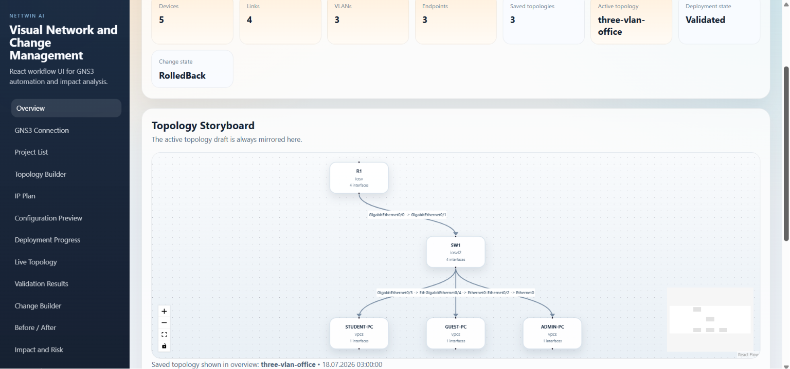

### Project List

Saved topologies created from the builder are listed here. Operators can load an existing topology draft or delete a saved one before continuing with the workflow.

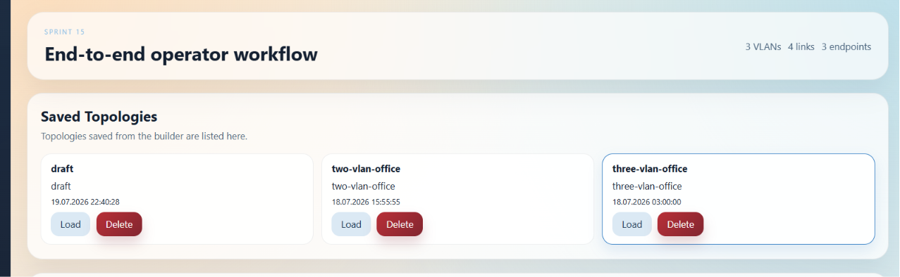

### Topology Builder

The topology builder is used to name devices, add routers/switches/endpoints/VLANs, and create links through interface-aware selections. It also explains how `GigabitEthernet` uplinks and endpoint access links should be used.

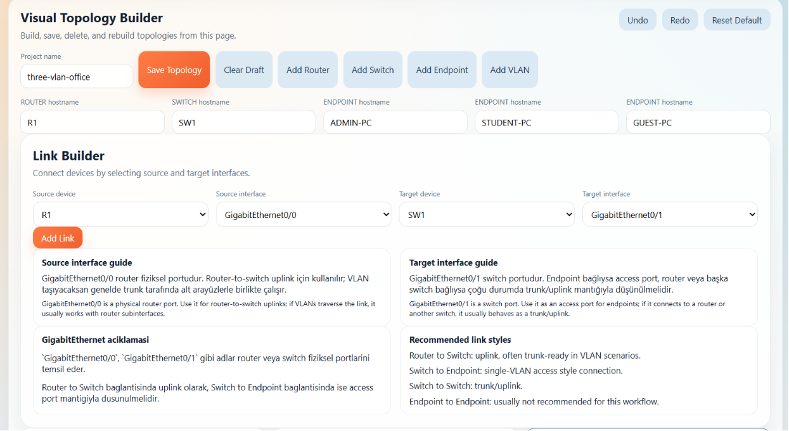

### Validation-safe Draft JSON

Every UI action updates a vendor-neutral `TopologySpec` draft. This JSON view is useful for debugging, backend validation, and comparing the UI state with the API payload.

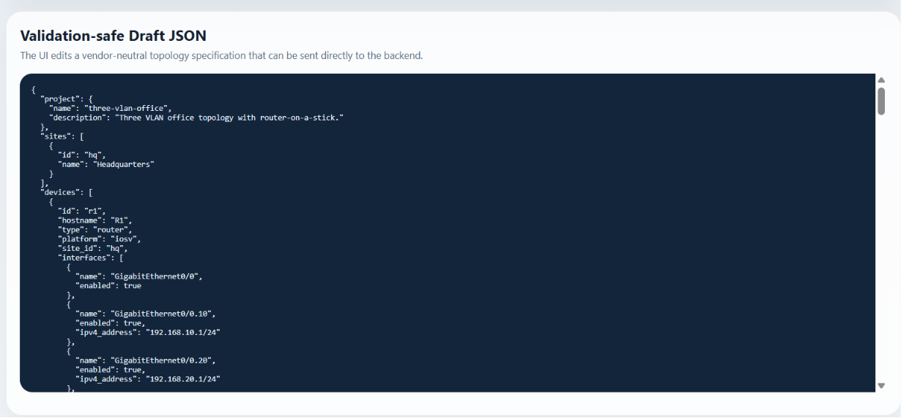

### IP Address Plan

The IP planning page supports automatic VLSM generation and manual segment planning. It also provides bilingual guidance so users can understand when a base network or host request fits the current topology.

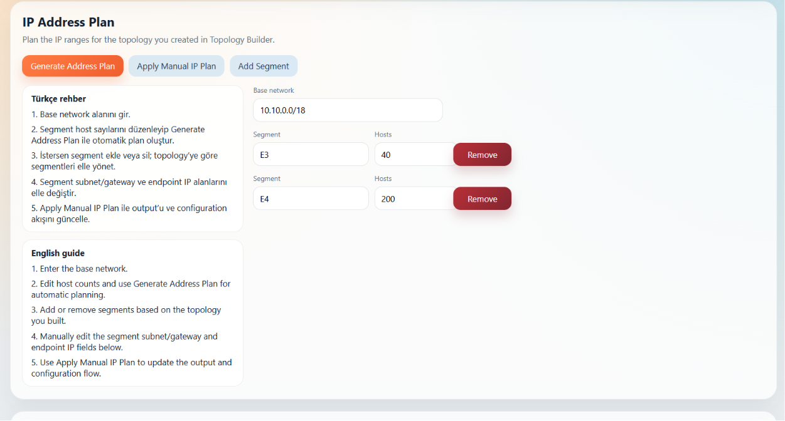

### Manual Segment and Endpoint Mapping

After IP planning, each segment exposes editable subnet, gateway, endpoint IP, and endpoint gateway fields. These values feed the next configuration render and now stay synchronized with topology assignments.

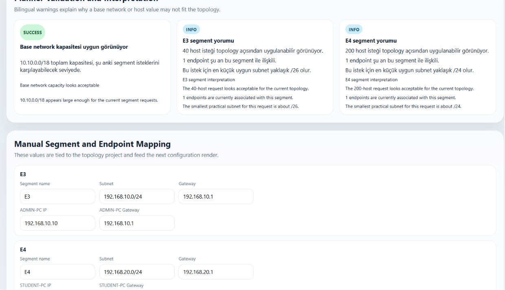

### Configuration Preview

The configuration page renders per-device router, switch, and VPCS configuration output derived from the topology and addressing data. This is the final deterministic preview before apply/discover/validate steps.

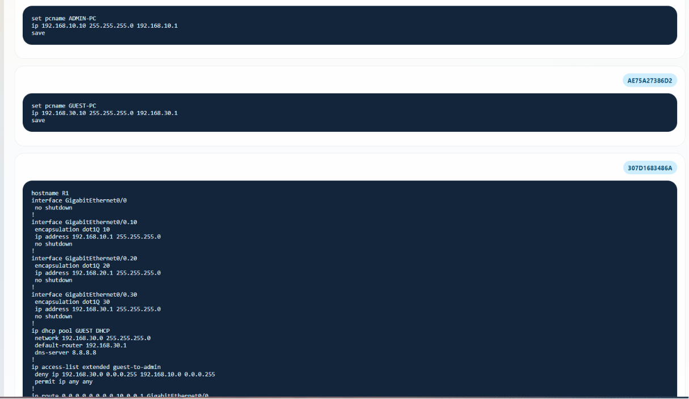

### Deployment Progress

The deployment page shows the dry-run workflow, configuration generation state, discovery state, validation status, and WebSocket-backed progress history for the active deployment.

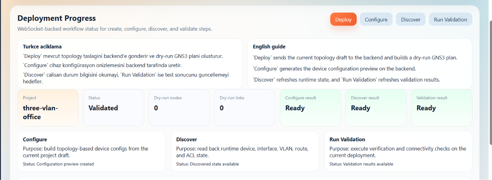

### Live Network Topology

The live topology page visualizes discovered device and link state. It helps compare the intended topology against runtime-style discovered status and interface health.

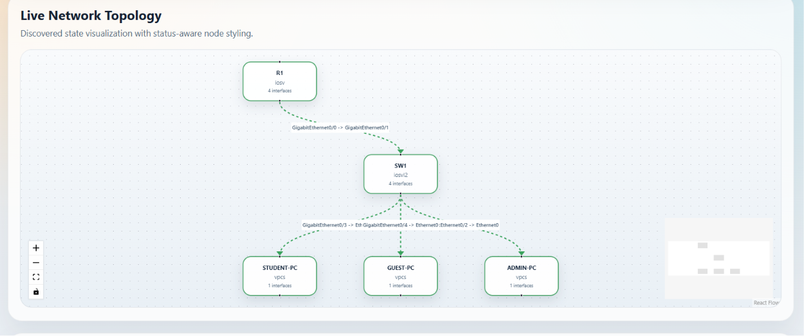

### Validation Results

The validation page displays model-based reachability outcomes and user-friendly bilingual remediation guidance. Endpoint names, segment names, suggested field values, and page-by-page fix steps are shown directly in the result cards.

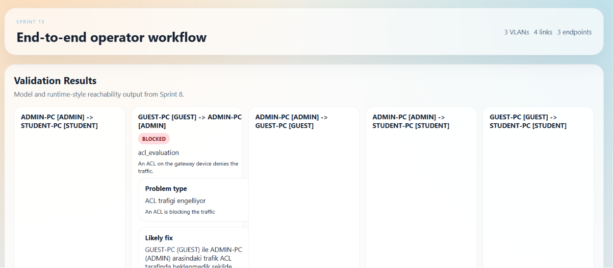

### Before / After Comparison

The before/after page shows the deterministic simulation result side by side. Operators can compare the pre-change reachable paths with the post-change failure stages, evaluated routes, ACL decisions, and technical explanations before approving any action.

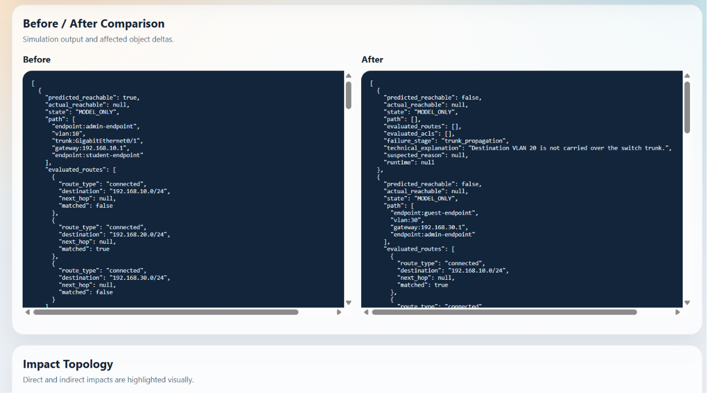

### Impact Topology

The impact topology visualizes the same change result on the network graph. Normal links stay neutral, transit devices are highlighted, affected endpoints turn red, and broken paths are emphasized so the operator can immediately see where the simulated change disrupts the topology.

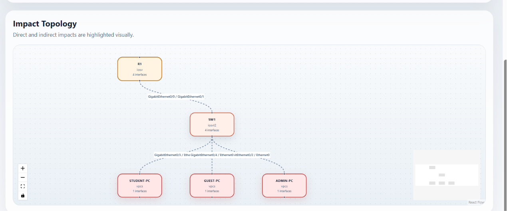

## Sprint 15 Usage

### Start the Backend API

```powershell
cd backend
.venv\Scripts\Activate.ps1
uvicorn app.main:app --reload
```

What this does:

- starts the FastAPI backend on `http://127.0.0.1:8000`
- exposes the Sprint 14 workflow endpoints used by the UI
- enables `/health`, `/api/v1/...`, and workflow WebSocket progress streams

### Start the Sprint 15 Frontend

```powershell
cd frontend
cmd /c npm run dev
```

What this does:

- starts the Vite development server, usually on `http://127.0.0.1:5173`
- loads the multi-page Sprint 15 operator UI
- connects the UI to the backend workflow API

### Open the UI and Run the Main Workflow

Recommended order inside the UI:

1. `GNS3 Connection`
2. `Project List`
3. `Topology Builder`
4. `IP Plan`
5. `Configuration Preview`
6. `Deployment Progress`
7. `Live Topology`
8. `Validation Results`
9. `Change Builder`
10. `Before / After`
11. `Impact and Risk`
12. `Approval`
13. `Rollback`
14. `Audit History`

What this proves:

- the frontend can drive the backend workflow from topology draft to change approval
- the UI can call validation, simulation, and risk endpoints
- deployment and change progress events can be consumed through WebSocket

### Verify the Frontend TypeScript Build

```powershell
cd frontend
cmd /c .\node_modules\.bin\tsc.cmd --noEmit
```

What this validates:

- the Sprint 15 React and TypeScript code compiles cleanly
- typed API payloads and page wiring are internally consistent

### Optional Frontend Production Build Check

```powershell
cd frontend
cmd /c npm run build
```

Note:

- if `vite build` fails inside a restricted sandbox with an `EPERM` temp-file error, that is an environment limitation
- the TypeScript check above is the safer verification command in that case

## Sprint 16 Deliverables

- provider-independent natural-language AI interface
- strict structured output with Pydantic validation
- topology interpretation preview
- change-command interpretation preview
- deterministic result explanation endpoint
- prompt-injection detection and context sanitization
- mocked valid, malformed, ambiguous, and unsafe AI tests

## Sprint 16 Usage

### Run AI Layer Tests

```powershell
cd backend
.venv\Scripts\Activate.ps1
pytest tests/test_ai_service.py -q
```

### Interpret a Natural-Language Topology Request

```powershell
Invoke-RestMethod -Method Post -Uri http://127.0.0.1:8000/api/v1/ai/topology `
  -ContentType "application/json" `
  -Body '{"prompt":"Üç VLAN''lı küçük ofis ağı kur. Guest ağı Admin ağına erişemesin."}'
```

### Interpret a Natural-Language Change Request

```powershell
Invoke-RestMethod -Method Post -Uri http://127.0.0.1:8000/api/v1/ai/change `
  -ContentType "application/json" `
  -Body '{"prompt":"STUDENT VLAN''ını trunk bağlantısından kaldır.","specification":{"project":{"name":"demo"},"devices":[],"links":[],"vlans":[],"subnets":[],"endpoints":[],"routes":[],"routing_protocols":[],"acls":[],"services":[],"connectivity_requirements":[],"validation_tests":[]}}'
```

### Explain Deterministic Results

```powershell
Invoke-RestMethod -Method Post -Uri http://127.0.0.1:8000/api/v1/ai/explain `
  -ContentType "application/json" `
  -Body '{"simulation":{"command_type":"REMOVE_VLAN_FROM_TRUNK"},"risk":{"total_score":55,"risk_level":"High"},"validations":[]}'
```

## Sprint 17 Deliverables

- HTML and PDF report generation
- backend coverage, linting, typing, and security toolchain config
- frontend Vitest and Playwright scaffolding
- optional real GNS3 test
- GitHub Actions CI workflow
- environment and security documentation
- release-oriented README sections and demo prompts

## Sprint 17 Usage

### Run Full Backend Test Suite

```powershell
cd backend
.venv\Scripts\Activate.ps1
pytest tests -q
```

### Generate a Workflow Report

```powershell
Invoke-RestMethod -Method Post -Uri http://127.0.0.1:8000/api/v1/reports/generate `
  -ContentType "application/json" `
  -Body '{"deployment_id":"YOUR_DEPLOYMENT_ID","change_id":"YOUR_CHANGE_ID","user_requirements":["Guest VLAN impact review"]}'
```

### Frontend Typecheck

```powershell
cd frontend
cmd /c .\node_modules\.bin\tsc.cmd --noEmit
```

### Planned Frontend Test Commands

```powershell
cd frontend
cmd /c npm run test
cmd /c npm run e2e
```

### Optional Real GNS3 Test

```powershell
cd backend
$env:NETTWIN_RUN_REAL_GNS3="1"
$env:GNS3_SERVER_URL="http://[::1]:3080"
pytest tests/test_real_gns3_optional.py -q
```

## Release Docs

- [Architecture](docs/architecture.md)
- [Environment Guide](docs/environment.md)
- [Security Model](docs/security-model.md)
- [Demo Prompts](docs/demo-prompts.md)

## Current Status

Current implementation includes:

- Sprint 0 project scaffolding
- Sprint 1 topology domain model and validation
- Sprint 2 VLSM and IP addressing planner
- Sprint 3 GNS3 client and resource management layer
- Sprint 4 topology deployment and port mapping engine
- Sprint 5 configuration generation engine
- Sprint 6 configuration deployment and discovery foundation
- Sprint 7 digital twin graph engine
- Sprint 8 hybrid reachability and validation foundation
- Sprint 9 typed network change commands
- Sprint 10 immutable change simulation and impact analysis
- Sprint 11 explainable risk scoring and recommendations
- Sprint 12 approved change deployment and rollback workflow
- Sprint 13 deterministic root cause analysis
- Sprint 14 FastAPI workflow API and WebSocket progress layer
- Sprint 15 React visual network and change management UI
- Sprint 16 natural-language AI interpretation layer
- Sprint 17 reporting, release, CI, and test scaffolding

Business logic for GNS3 deployment, configuration application, discovery, simulation, and impact analysis is still deferred to later sprints.
