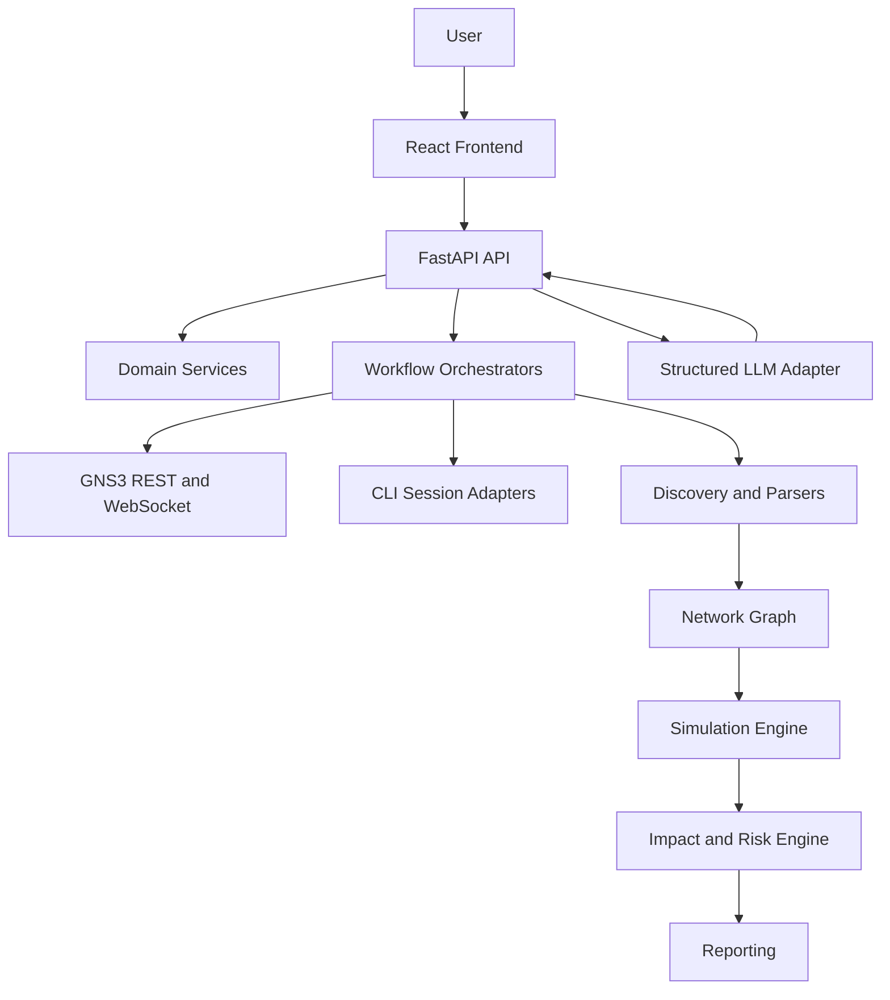

# NetTwin AI Architecture

## Purpose

NetTwin AI combines network deployment automation with pre-change impact analysis on a shared digital model.

## Architectural Principles

- vendor-neutral domain model first
- clear separation between domain, infrastructure, and transport layers
- deterministic engines for validation, simulation, and risk
- human approval before destructive or impactful actions
- testable modules with low coupling

## Layered Design

### Domain Layer

Contains vendor-neutral models such as devices, interfaces, VLANs, subnets, routes, ACLs, and change commands.

### Application Layer

Coordinates workflows such as deployment, discovery, simulation, approval, rollback, and reporting.

### Infrastructure Layer

Implements GNS3 clients, CLI sessions, parsers, persistence, and external provider adapters.

### API/UI Layer

Exposes workflow orchestration through FastAPI and a React-based operator interface.

## Mermaid System Diagram

## Sprint 0 Scope Boundary

Implemented now:

- repository structure
- FastAPI app bootstrap
- configuration management
- structured logging
- placeholder modules for planned bounded contexts
- frontend placeholder
- basic health endpoint and tests

Not implemented yet:

- domain business rules
- GNS3 deployment
- configuration generation
- discovery parsing
- simulation
- risk scoring
- rollback logic

## Initial Development Flow

1. Validate GNS3 server reachability.
2. Build vendor-neutral domain model.
3. Add GNS3 integration behind interfaces.
4. Add deterministic validation and simulation engines.
5. Add UI and AI layers after core logic stabilizes.

